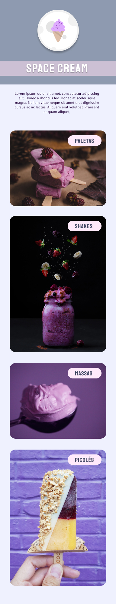

<h1 align="center"> Project - Space Cream </h1>

Study challenge about GRID, @Keyframes and variables

  <a href="#-tecnologias">Tecnologias</a>&nbsp;&nbsp;&nbsp;|&nbsp;&nbsp;&nbsp;
  <a href="#-projeto">Projeto</a>&nbsp;&nbsp;&nbsp;|&nbsp;&nbsp;&nbsp;
  <a href="#memo-licença">Licença</a>

  

 

  

## 🚀 Tecnologias

This project was developed with the following technologies:

- HTML and CSS
- Git and Github
- Figma

## 💻 Projeto

This site is just for studies, applying what was learned in class.

- [Acesse o projeto finalizado, online](https://malcarale.github.io/space-cream)

## :memo: Licença

Esse projeto está sob a licença MIT.

---

Feito com ♥ by Malcar
